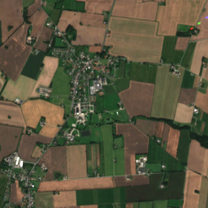
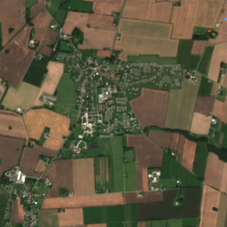
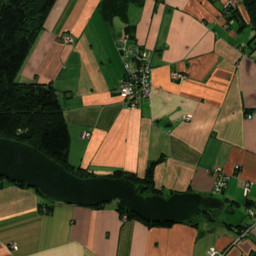
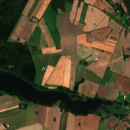
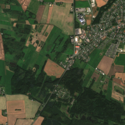
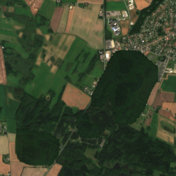
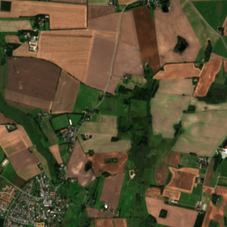
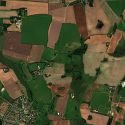

# Generative Neural Networks for Ecosystem Simulation

### Creating a town

 

### Town to cultivate land

 

### Expanding a forest

 

### Cultivated area to herbaceous vegetation

 

## Code

The main model is in code/model, the inpainting model is in code/inpaint and the landcover model in code/landcover_model. Each folder contains a README.md that explain the models in some detail. More details can be found in the thesis.

## Drawing tool

To run the drawing tool run

```
python main.py
```

but the appropriate models will have to be downloaded and stored in the correct folders.
