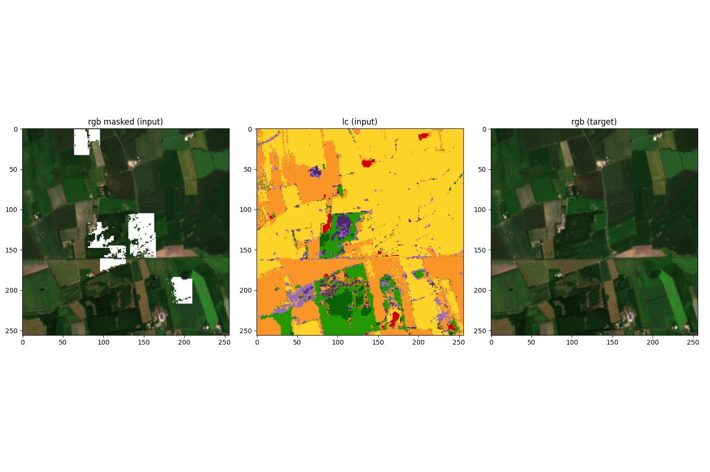
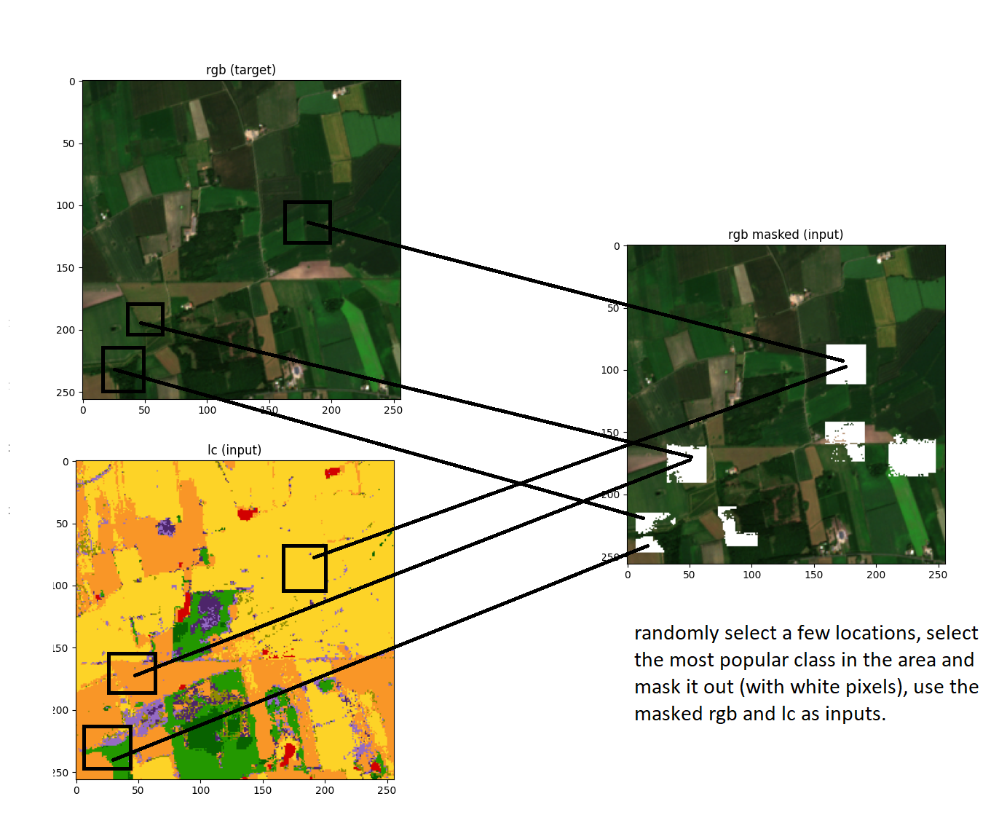
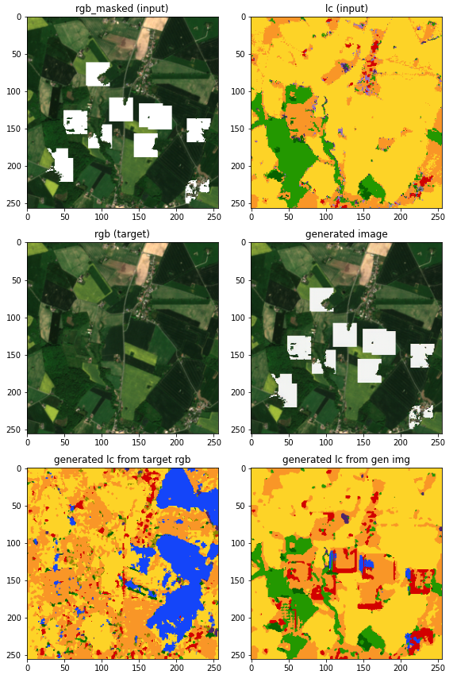

# Inpaint most common calls

Idea: use a masked_rgb and lc as input, original_rgb as target. The mask will be generated by taking an a few patches an removing the most common class in each patch.

Use vgg as a feature loss and use the ACGAN idea for the discriminator. I think making the discriminator also create a landcover as a sidetaks make sense, or at least that is how I understand the ACGAN idea.

## Data

The satellite and landcover data as in the other examples. Each sample uses the rgb and landcover (lc).

Illustration of how data is created.

This might lead to classes that never cover a big area to be poorly represented...

## Arcitechture

The arcitechture is similar to the arcitechture of vgg_mixlc, except the discriminator also generates a landcover classification.

### Generator

The input is both rgb_masked and the landcover.
The generator uses two networks side by side. Then they are concatenated and set into two convolutional layers and finally a tanh layer. The network could be more carefully chosen.

### Discriminator

The ACGAN idea comes here into play. We make the discriminator both create a classification of the rgb images, that is to create a landcover image. Then that is passed through one more layer and a 16x16 patch gan idea is used to say if the patches of the image is real or fake.

The problem is that the discriminator would only output 1's, I think this idea of making it classify and then do the patchGAN is bad.

## Training

### Losses

We use a MSE loss for the discriminator patches. We use l1 as the pixel loss. We also use the VGG16 and the output of the relu_3_3 as a feature loss and a MSE loss between the target and generated image.

The VGG16 idea is from https://deepai.org/machine-learning-glossary-and-terms/perceptual-loss-function, this idea is used in https://www.ijcai.org/proceedings/2019/0433.pdf

### Time

Less than 1 hour per epoch on colab.

## Results

The results were bad, the acgan discriminator was implemented incorrectly...

After 6 epochs

## Discussion
