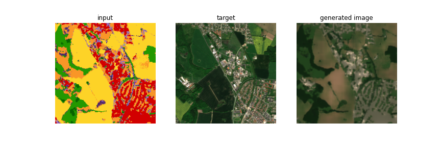
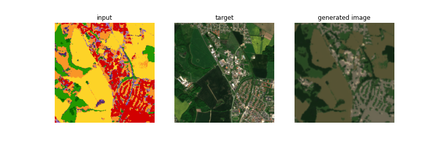

## Class to img

Here I will attempt to create a satellite image from the classes. Using a Unet architectur.

## Data

We use the rgb data from satellite.zip and the landcover classes from denmark_landcover.tif. The classes are one hot encoded and fed into the generator which creates an image. If this can model can learn to create the target image, then we should be able to put in arbitrary classes and generate images that are plausible. or something.

### Result

After 30 epochs we get:

Compared to after one epoch.

I think the model is not learning anything beyond the first epoch. I think my loss functions are off. I use BCEWithLogitsLoss for the ganloss, which is used by the discriminator and the generator, but also the l1loss for the generator, the l1 loss has much more weight in the generator loss.

## Next

I thin that doing a cycleGAN and using this model and the pix2pix-type model but utilizing the cycle consistancy loss would possibly give interesting results. I need to read more about losses though.
