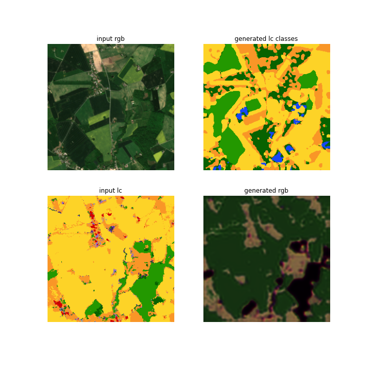
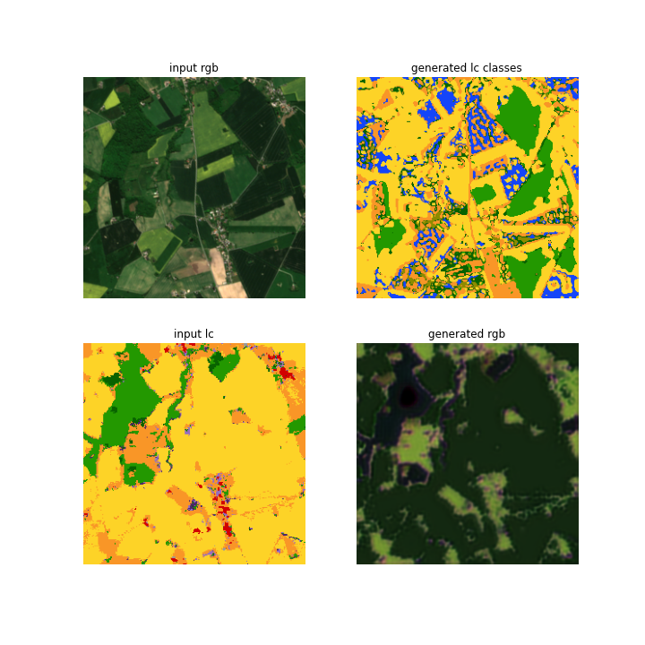

## First cycleGAN test

### Thoughts

- Make a Replaybuffer
- Plotting the loss shows that there might be some bug. Check other papers to see how the loss progresses there.
- What do the losses enforce?
- Activation layer for the discriminator?

## Data

Same data as in the classes-to-img but here I use a random horizontal and vertical flip.

## Network arcitechture

The network consists of 4 models, two discriminators and two generators.

All models take a 256x256 image.

### Generators

Landcover-to-RGB input is a 256x256 image where each pixel is a one-hot encoded classification of the landcover. 14 classes. Output is a rgb image. The network follows the CycleGAN arcitechture, the final activation function is a Tanh.

RGB-to-landcover, input is a 256x256 rgb image and output is a probablitiy distribution over the 14 classes of the landcover for each pixel. That is the final activation function is a Softmax. Otherwise the network arcitechture is the same as the cycleGAN.

The generators have approx. 11.4 million parameters.

### Discriminators

Both discriminators are the same except one takes as input the classes and the other rgb for each pixels.

The output of both are 16\*16 of overlapping patches that say if the input was real or fake. I did not use a activation layer as the last layer. That maybe a misstake.

The discriminators have approx. 2.7 million parameters.

## Loss

The adverserial loss is MSELoss. Maybe it doesn't make sense to use that for the classes_discriminator, since it is not really creating a image.

The cycle loss used are

For the classes generator a CrossEntropyLoss.

For the image generator a L1Loss.

We cannot use identity loss since the generators don't create images with the same number of channels.

## Training

I tried this in colab using the GPUs. Each epoch took around 58 minutes.

## Results

After 1 epoch

After 5 epochs

Is it learning something? It's only been a few epochs, I would be a good idea to run for at least 100 epochs, I think they did that in the cycleGAN paper. But I am not sure if there is a reason to do so. The generated RGB seems to be a bit more detailed after 5 epochs.

The generated LC image is very weird, and extremely wrong. There might be a bug in the loss or not enough epochs.

Before running for more epochs I would like to verify the loss functions and think if they make sense.
