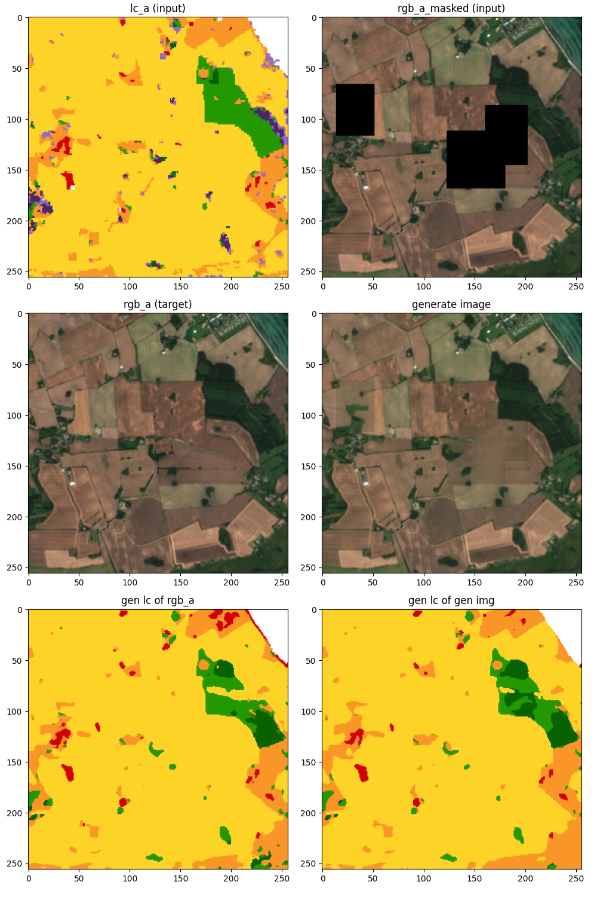

# Inpainting

Just experiment with inpainting.

Has a similar architecture to the Model. We created this to be used as a comparison with the Model.

## Idea

The generator gets a masked rgb and uses information from the landcover to fill in the masked areas.

If we feed in our changes into the masked area we could do some changes in the rgb.

### Examples

I think we get pretty good results, sometimes the colors don't excatly match.

