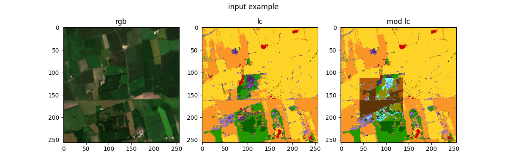
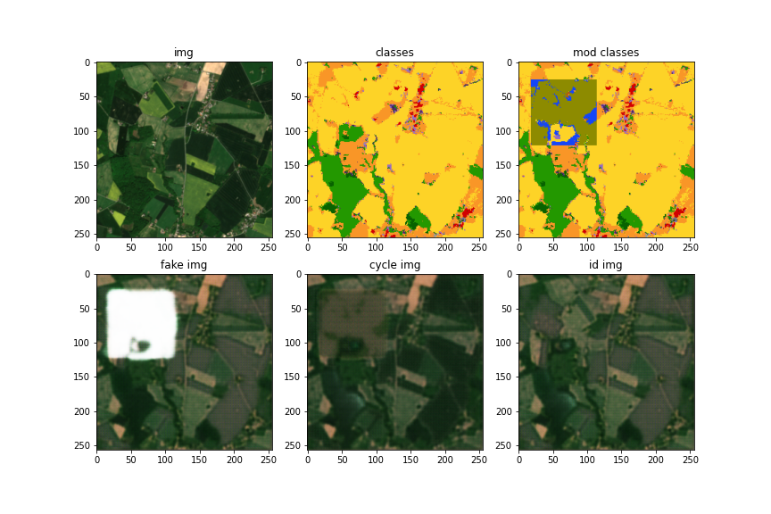
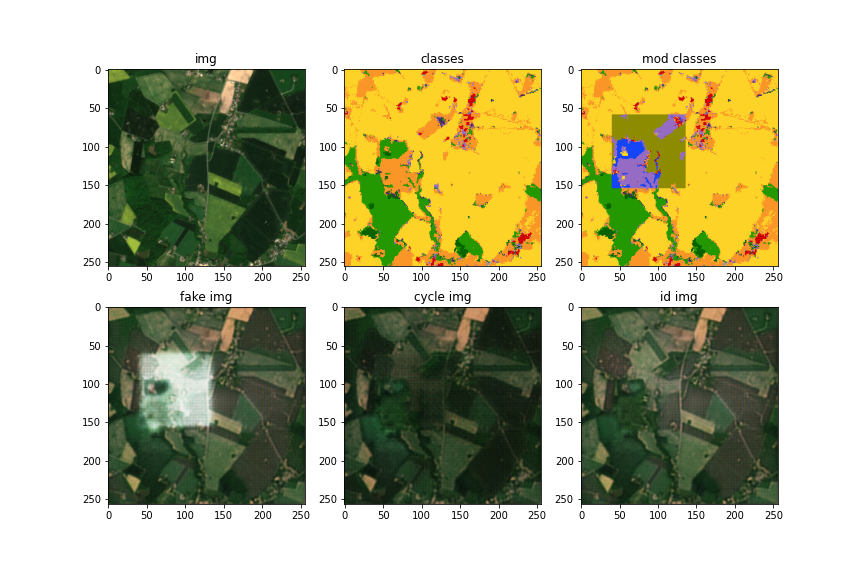

## Inpainting cycleGAN

Here is my first experiment with using inpainting and cycleGAN.

### Data

The input uses a rgb and lc. We modify the lc to create mod_lc. This involves taking an area of the image (for now the middle 64x64) and mapping each class to some other random class. For example "Cultivated areas" becomes "Artificail surfaces", though "Clouds" and "No data" don't map.

The input to the generator is the rgb and mod_lc, the output is gen_mod_rgb. For the cycle aspect we use as input the gen_mod_rgb and lc as input and want to get rgb back. That is if our generator is G:

G(rgb, mod_lc) = gen_mod_rgb

G(gen_mod_rgb, lc) = cycle_rgb

and we want cycle_rgb = rgb.

The easiest way for the generator to do this is by having

rgb = gen_mod_rgb = cycle_rgb

So we have to set a contraint that the mod area of gen_mod_rgb =/= same area of rgb

I will try to implement this with 1 - pixel_loss(area_gen_mod_rgb, area_rgb)

where "area" is the 64x64 area in the a random place of the image.

This is the first time training with random locations of the "inpainted" area.

An input example

## Network architectur

### Discriminator

I use the same discriminator as the global discriminator in local and global paper.

### Generator

I use the same one as in mix-lc experiment.

## Training

Either use MSELoss or BCEWithLogitsLoss as the adversarial loss, if MSE first run the output through sigmoid layer.

The pixel loss is l1 loss with no regularization.

## Results

I could not train it in the colab for more than 2 epochs as I ran out of computational resources.

After 1 epoch:

After 2 epochs:

I also just used 1000 samples instead of all 11000, so training more could give some results.

The checkerboard effect could be removed with more training and utilizing perception loss, by using the VGG model or something similar for a style loss as in https://www.ijcai.org/proceedings/2019/0433.pdf
