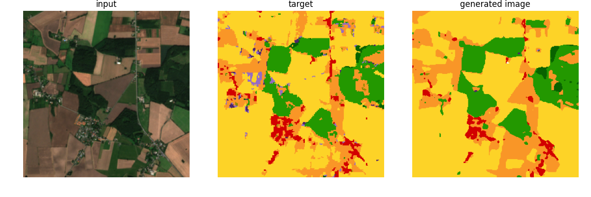
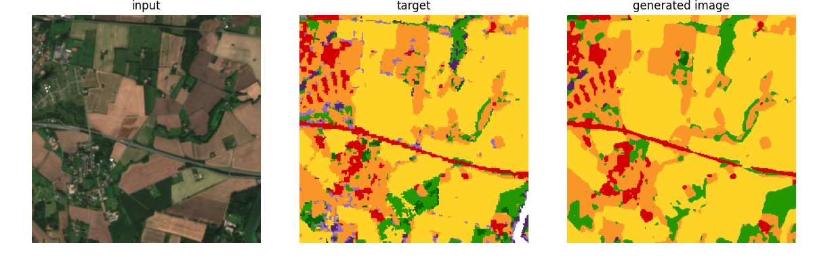

## Landcover model

Takes as input a rgb and generates its landcover.

The model is a Unet and trains using CrossEntropyLoss and IoU loss, which is 1-IoU(y, y_target).

It had 79 % accuracy from the validation data.

### Examples

