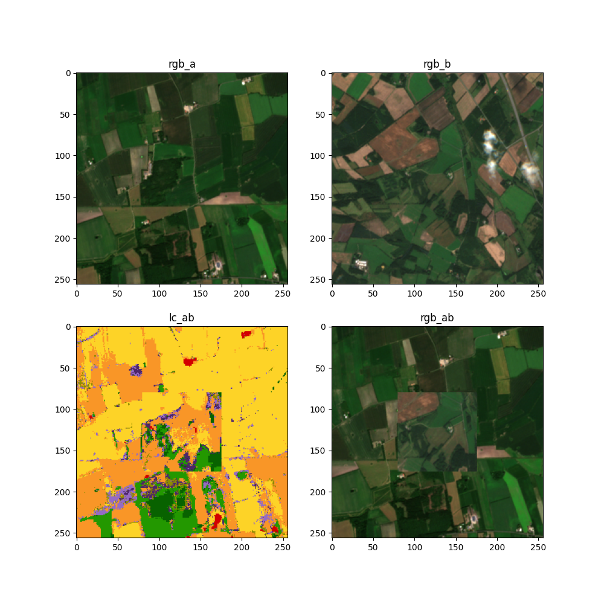
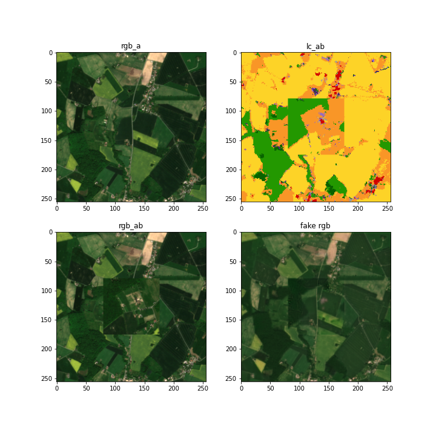

# Mix LC

This is my first experiment with mixing landcovers as input. That is take a part of a landcover from one image and another from one. Then we do the same for the target.

## Data

We eventually want to do inpainting cycleGAN. Since we don't have paired targets to modified landcover images, we want to use the cycleGAN feature, since it can use unpaired targets.

Now before I start that I wanted to try some inpainting and creating some targets.

These targets may look unnatural and so the cycleGAN idea is probably much better. The problem I see with cycleGAN is I fear it will try to create the original image, unless we constrain it somehow to not create it. We could create a model that learns to classify the rgb image to classes (like I did in pix2pix-type) and make sure the classes generated are not the same. But then there is a problem that that generator is probably not excatly accurate, but maybe accurate enough...

Each sample is 2 rgb and 2 lc, rgb_a, rgb_b, lc_a, lc_b.
We will create images rgb_ab and lc_ab which are rgb_a with a square in it from rgb_b and lc_a with the same square from lc_b. The square location can be randomized or can only be in the center for now.
The input to the model will be rgb_a concat with lc_ab, the target will be rgb_ab.

We can add to that by also having rgb_b concat with lc_ab and the target also rgb_ab.

I am thinking of using the local and global discriminator idea from the paper with that name.

The input looks like this:

## Network arcitechture

### Generator

This will have a unet architecture, with a downsampling phase and a upsampling phase.

The input to the generator are two images, the rgb_a and the lc_ab. I can think of two ways of treating them.

One is to concatenate them in the beginning and then treating them as one input.

The other is to downsample them seperetly and then in the upsampling phase, concatenate them. Then it makes sense to use dialated convolution for the lc_ab but not rgb_a.

I think I will start with the first option of concatenating them in the beginning.

### Discriminator

I am not sure weather to use local and global discriminators.

For starts I will just use the global discriminator.

### Training

### Results

After one epoch

After 6 epochs

I believe it learns something and it could be interesting to run it for a few more epochs and refine the losses and such.
