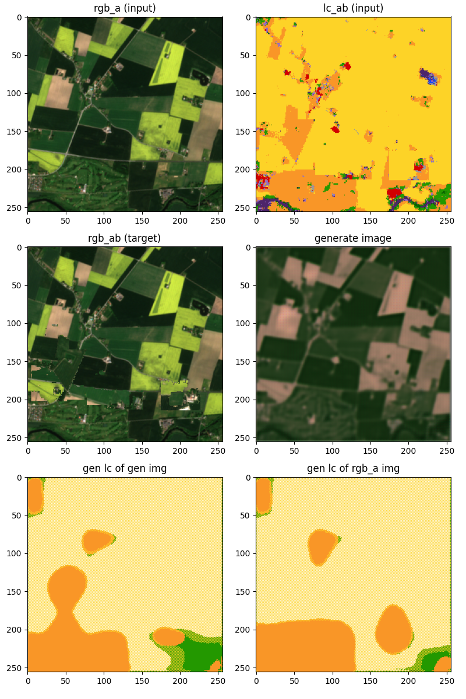
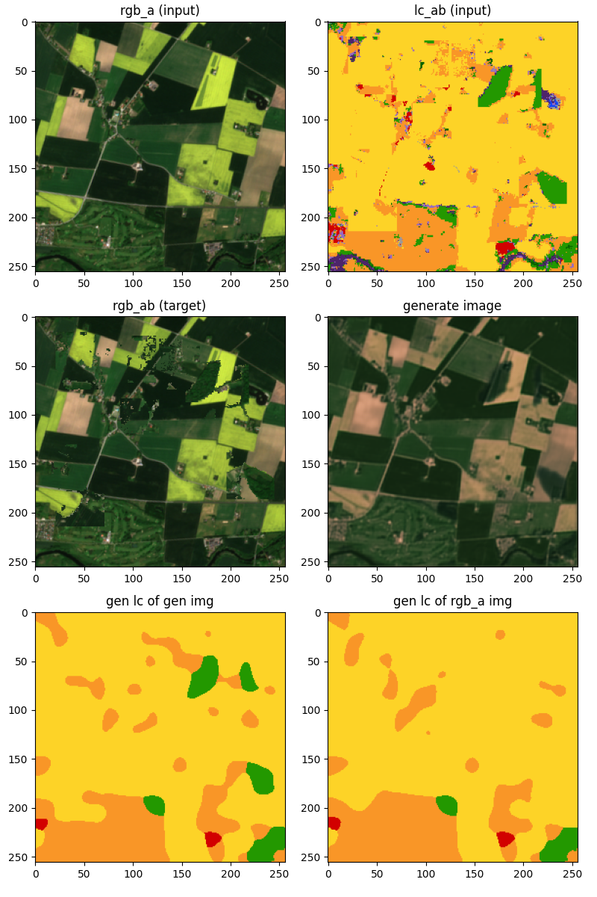

# MixLC ACGAN

Idea: use the mix landcover to creat targets idea and ACGAN.

### Questions

- Use dropout in the discriminator?
- Should I be using random noise, I haven't been using any in any of the other models I have created. I don't think any of the image transformation models like pix2pix and cycleGAN use a random noise vector.
  In pix2pix they don't use a random noise vector as an input but rather use dropout as the random noise.

## Network arcitechture

### Generator

### Discriminator

## Training

### Losses

The progression of the loss could tell us something.

The lambdas for the generator are
STYLE_LAMBDA = 0.45
ADV_LAMBDA = 0.05
PIXEL_LAMBDA = 0.5

while the discriminator uses all losses equally.

The generator does not seem to be fooling the discriminator.

## Results

I trained on the slurm cluster for 20 epochs. Each epoch took about 38 minutes.

After 1 epoch

After 20 epochs

