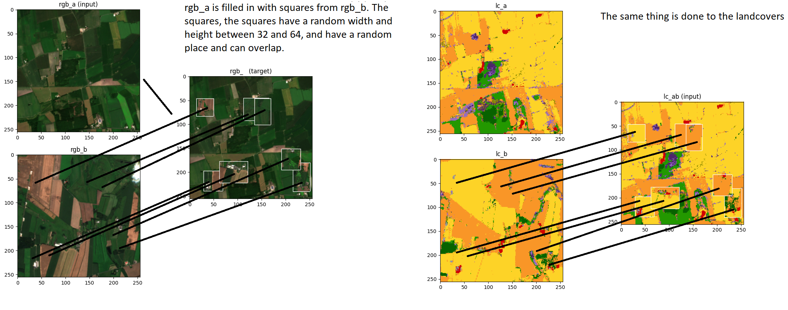
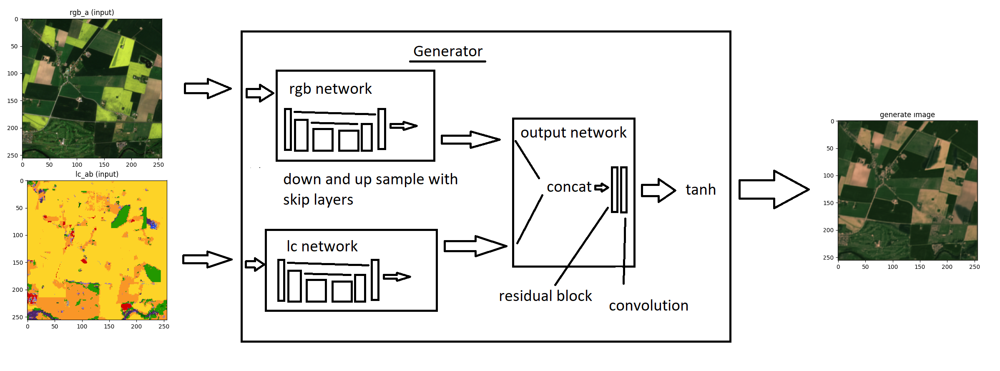
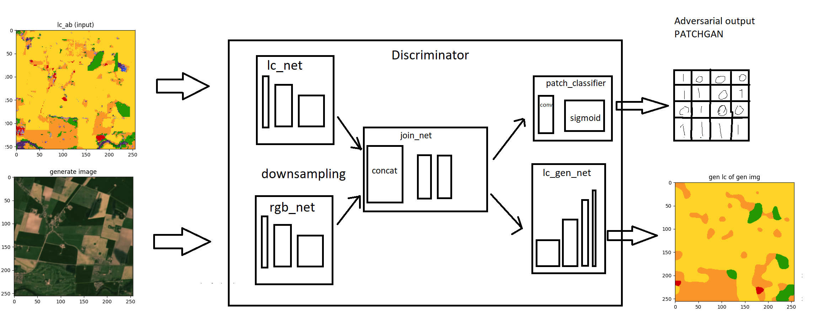
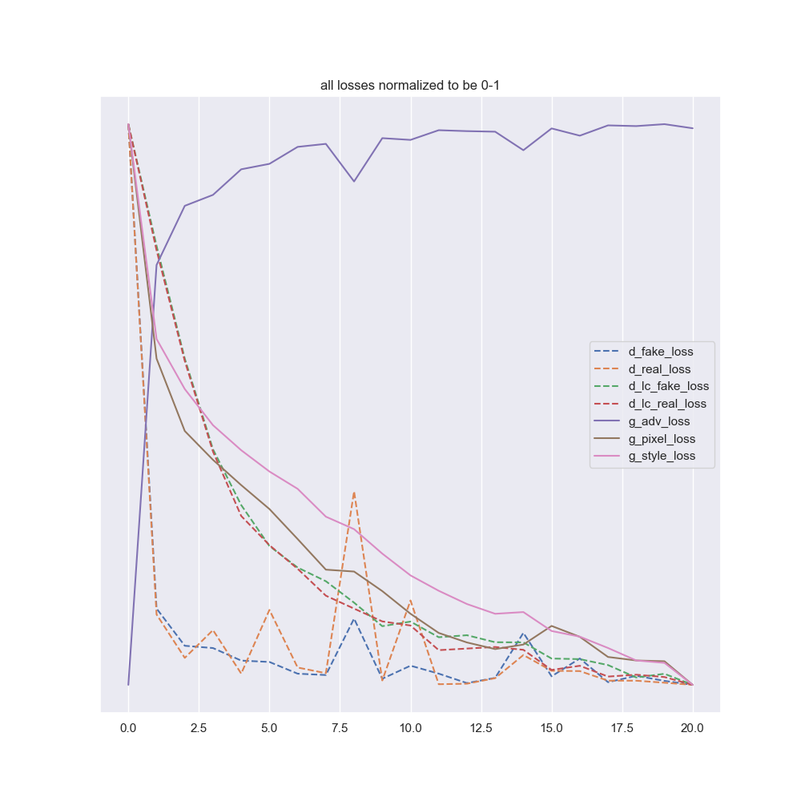

# MixLC ACGAN

Idea: use the mix landcover to creat targets idea and ACGAN.

### Questions

- Use dropout in the discriminator?
- Should I be using random noise, I haven't been using any in any of the other models I have created. I don't think any of the image transformation models like pix2pix and cycleGAN use a random noise vector.
  In pix2pix they don't use a random noise vector as an input but rather use dropout as the random noise.
- Add a identity loss, put "generator(rgb_a, lc_a) == rgb_a" use l1_pixel loss

## Data

Each sample is 2 rgb and 2 lc, rgb_a, rgb_b, lc_a, lc_b.
We will create images rgb_ab and lc_ab which are rgb_a with a square in it from rgb_b and lc_a with the same square from lc_b. The square location can be randomized or can only be in the center for now.
The input to the model will be rgb_a concat with lc_ab, the target will be rgb_ab.

I use horizontal or vertical flip each with a 0.5 probability.

Data generation.

## Network arcitechture

### Generator

The generator takes as input a rgb and a lc and outputs a rgb based off both images.

Inside there are two networks both based on a common image transformation arcitechture, using downsampling, upsampling and skiplayers. The two networks I call rgb_net and lc_net, since rgb_net only uses the rgb as input and the lc_net uses the lc as input. The output of these networks is concatenated and then put through the output_net which consists of one residual block and one convolutional block.

A block is a convonlutional layer, batchnorm, dropout and relu activation.

In pix2pix they don't use a random noise vector as an input, they say the generator learns to ignore it. So instead they use a dropout of 0.5 in both training and evaluation as the random noise. I do the same as them.

A crude sketch of the generator:

### Discriminator

The discriminator takes as input a rgb and a lc. It outputs a 8x8 patch each patch being a guess on if the image is real or fake, it also outputs a classification of each pixel in the rgb, using the lc, this is the auxillary task which makes this a ACGAN. It is basically generating a lc.

A crude sketch of the disriminator:

## Training

### Losses

The progression of the loss could tell us something.

The lambdas for the generator are
STYLE_LAMBDA = 0.45
ADV_LAMBDA = 0.05
PIXEL_LAMBDA = 0.5

while the discriminator uses all losses equally.

The generator does not seem to be fooling the discriminator.

The style reconstruction loss is based off instructions from https://arxiv.org/pdf/1603.08155.pdf, where we define the Gram matrix G_j where phi_j is the output of the relu3_3 in this case.
Then the style reconstruction loss is the squared Frobenius norm of the difference between the Gram matrices of the output and target images.

I think I could also add to that the output of other activation functions, that is more than relu3_3.

I then got the idea of also having an id_loss, where id_img = generator(rgb_a, lc_a) and the losses are l1loss(id_img, rgb_a), and the vgg style loss for style_loss(id_img, rgb_a).

## Results

https://drive.google.com/drive/u/0/folders/1-4BSShFdJD7AqlbD92gMyJZSMn_YoQ4o
