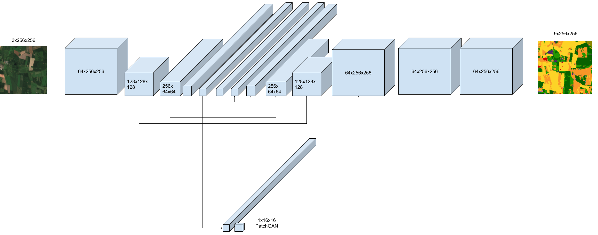
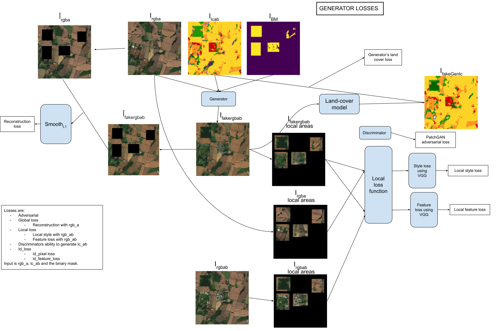

# Model

See thesis for explanation of architecture and more. The text here could be outdated.

## Data

In our data each sample is a 256x256 satellite image (rgb) and a corresponding landcover (lc). For each sample, we call (rgb_a, lc_a) we select another random sample (rgb_b, lc_b). We create a lc_ab by selecting 8 random places in lc_b, and create boxes with random width and height between 64 and 32. Then we create a binary mask with where those areas are.

## Network architecture

### Generator

concat the lc_ab and the mask and input to the lc_network

### Discriminator

## Losses

### Generator loss

The lambdas

- FEATURE_LAMBDA = 0.
- ADV_LAMBDA = 1
- PIXEL_LAMBDA = 1
- ID_LAMBDA = 0.15
- LOCAL_STYLE_LAMBDA = 1
- LOCAL_FEATURE_LAMBDA = 1
- LOCAL_PIXEL_LAMBDA = 0. or 1.
- G_LC_LAMBDA = 1

### Discriminator loss

All losses count the same for the discriminator.

## Evaluation

