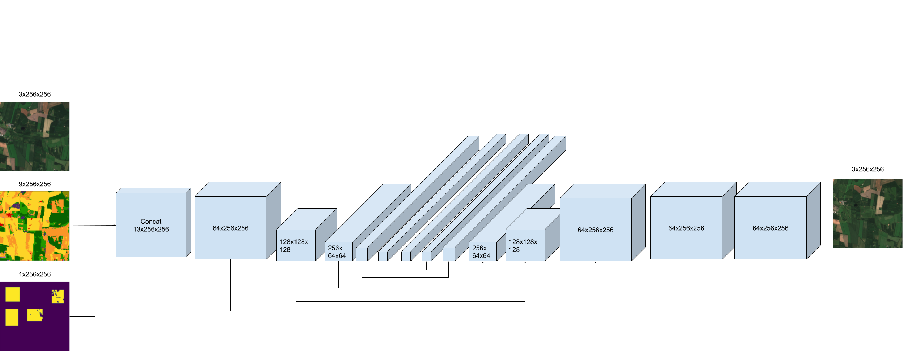

# Model

Here I will keep the changes for the model and (hopefully) not create more folders for experementing.

Will use the implementation we discussed in the meeting 18/06. With the inputs to the generator being (rgb_a, lc_ab, lc_mask).

## Data

In our data each sample is a 256x256 satellite image (rgb) and a corresponding landcover (lc). For each sample, we call (rgb_a, lc_a) we select another random sample (rgb_b, lc_b). We create a lc_ab by selecting 8 random places in lc_b, and create boxes with random width and height between 64 and 32. Then we create a binary mask with where those areas are.

## Network architecture

### Generator

concat the lc_ab and the mask and input to the lc_network

### Discriminator

## Losses

### Generator loss

The lambdas

- STYLE_LAMBDA = 0.
- ADV_LAMBDA = 0.5
- PIXEL_LAMBDA = 0.50
- ID_LAMBDA = 0.5
- LOCAL_STYLE_LAMBDA = 0.9
- LOCAL_PIXEL_LAMBDA = 0.
- G_LC_LAMBDA = 0.9

Maybe change the losses or pretrain with only ID_loss?

### Discriminator loss

All losses count the same for the discriminator.
