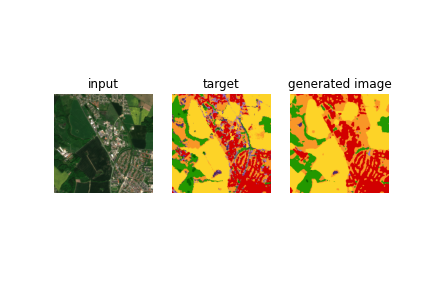
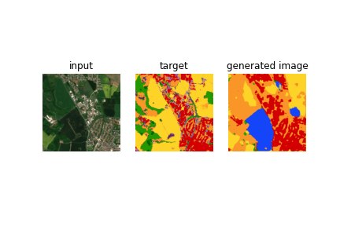

## Predicting classes

This is my first attempt using the satellite data.

## GAN experiment with the data

To experiment with the data and a GAN I create a GAN that takes as input a RGB image and outputs a one hot classified image. The one hot image is then converted into a pixel image.

The model uses a very similar architecture as the pix2pix model, except the output channels are 14 and the final layer is a Softmax.

I was having some issues with using a cross entropy loss, which I think would be better since this is basically a classification task.

The GAN loss also doesn't make since except if there is somekind of pattern of landscape that doesn't make sense.

### Training

I set the project into google colab to use the GPU.
There was an issue with using more than one worker, I suspect it had something to with me using the .npz file but I am not sure why.
First epoch took over 44 minutes but the rest about 5 and a half minutes.

### Result

After 15 epochs we get:

Compared to after one epoch.

So it seems the model is learning something.

## Discussion

I am not sure why I decided to do this first. But it was mainly to see what I needed to do with the data to get it in the format I want and get some feedback.
