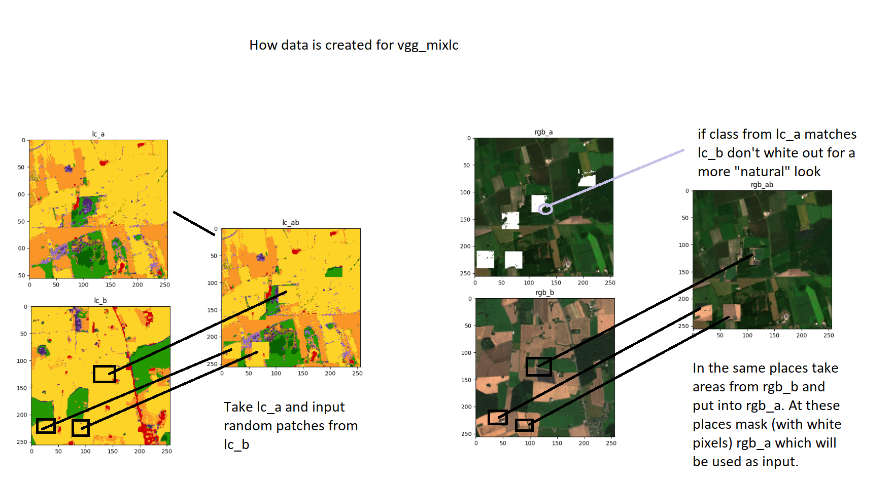
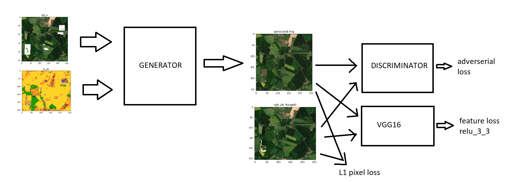
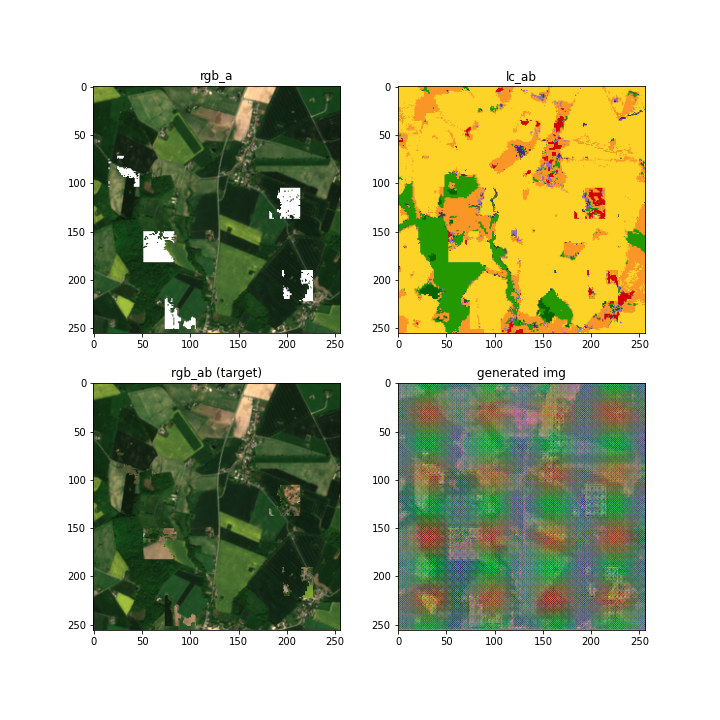
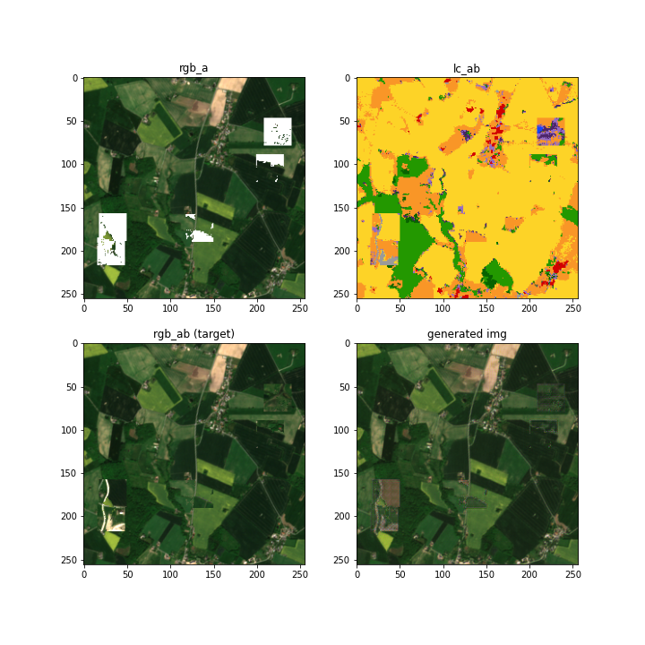

# ACGAN mixlc

Idea: use the mixlc, with only using rgb_a and lc_ab as the input. The lc_ab, will be lc_a with lc_b painted in irregularly.

I wanted to use the ACGAN idea in here but I am not sure how to implement it. I was thinking of having the discriminator classify each pixel in the rgb image. So it would work sort of like a class generator. And then possibly have one layer output the patchGAN idea.

## Data

The satellite and landcover data as in the other examples. Each sample uses two images rgb_a and rgb_b and two landcover classes lc_a and lc_b. We use lc_ab by putting patches from lc_b on top of lc_a. These patches are 32x32 in size and the rgb_a area is masked with white pixels we call this rgb_a_masked, this is the area where the inpainting will occure. We inpaint 5 random areas that can overlap. If the class of the lc_b patch matches lc_a class then we don't inpaint that are. We do that to make the input rgb_a_masked more natural. We also create a rgb_ab where the white pixels are replaced by the patches from rgb_b. The class idea also makes the target look a bit more natural. The input and targets look like the following. The rgb_b image is chosen at random.

Here I illustrate how the data samples are created:

## Arcitechture

### Generator

The input is both rgb_a_masked and lc_ab.
The generator uses two networks side by side. Then they are concatenated and set into two convolutional layers and finally a tanh layer. The network could be more carefully chosen.

### Discriminator

The discriminator uses the patchGAN idea. That is we downsample and add features and end with a 16x16 output. The idea is that we are classifying overlapping patches.

## Training

### Losses

We use a MSE loss for the discriminator patches. We use l1 as the pixel loss. We also use the VGG16 and the output of the relu_3_3 as a feature loss and a MSE loss between the target and generated image.

The VGG16 idea is from https://deepai.org/machine-learning-glossary-and-terms/perceptual-loss-function, this idea is used in https://www.ijcai.org/proceedings/2019/0433.pdf

### Time

On colab each iteration takes 2 or 3 hours, since I am waiting for real computation I only used 10 % of the training samples, but this showed promise.

## Results

After training on only 10% of the samples on a colab (because more took too long).

After 1 epoch

After 11 epochs

It seems to be learning something!

## Discussion

I think it a good idea to have more inpaintings. It would also be could to select patches in a better more natural way.
