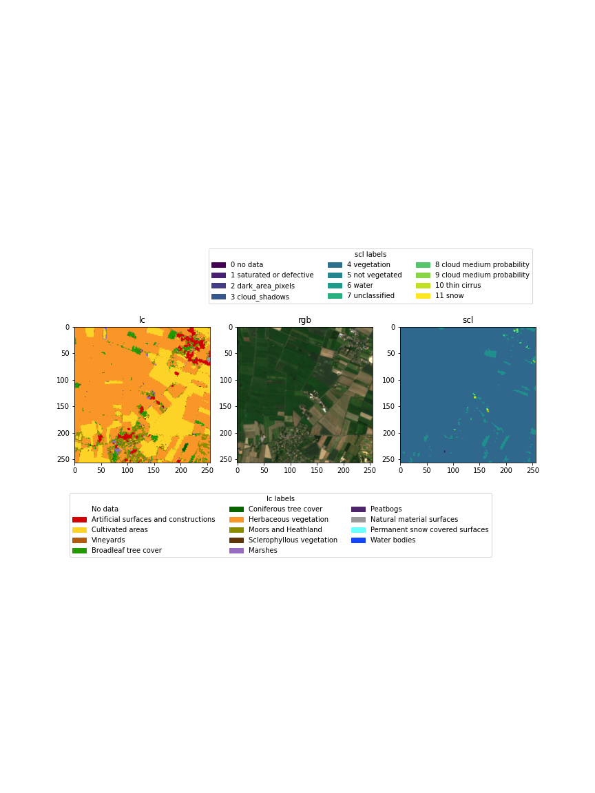

## Exploring the satellite data

https://sid.erda.dk/wsgi-bin/ls.py?share_id=GqxHnRQG12

denmark_landcover.tif -> the high res landcover classifications
satellite.zip -> contains the rgb and quality bands of sentinel2 observations (for now only denmark)
satellite folder -> same as the zip file (just download the zip file)
loading_example.ipynb -> walkthrough how to align the data, this should be applicable to other tiles than just the shown tile

## Creating the data

You need to have some python packages such as numpy, matplotlib, PIL etc.

You need to put denmark_landcover.tif and the satellite/ folder into the data/ dir.

To use and install rasterio, I recommend using Miniconda3.

```
conda install -c conda-forge rasterio
```

And then

```
python create_data.py
```

## Info about creating the data

Using the data I have on the 5.5.2021 split the satellite images into train, val and test. The images are 13 tiles, 11 are used for training, one for validation and one for testing.

For each tile we create a 256x256 window, if a sample is valid in that window we save it. Then we slide the window.
A valid window means there is almost no snow, less then 40% water and some more.

- Test: 3153
- Val: 2881
- Train: 12324

From the rgb images we find the correct location in the danmark_landcover.tif file (this code is from Stefan). The landcover has 14 possible classes for each pixel.



The landcover pixels are classifications are found in the following table.

| Pixel value | R   | G   | B   | Opacity | Class name                            |
| ----------- | --- | --- | --- | ------- | ------------------------------------- |
| 0           | 255 | 255 | 255 | 255     | Clouds                                |
| 62          | 210 | 0   | 0   | 255     | Artificial surfaces and constructions |
| 73          | 253 | 211 | 39  | 255     | Cultivated areas                      |
| 75          | 176 | 91  | 16  | 255     | Vineyards                             |
| 82          | 35  | 152 | 0   | 255     | Broadleaf tree cover                  |
| 83          | 8   | 98  | 0   | 255     | Coniferous tree cover                 |
| 102         | 249 | 150 | 39  | 255     | Herbaceous vegetation                 |
| 103         | 141 | 139 | 0   | 255     | Moors and Heathland                   |
| 104         | 95  | 53  | 6   | 255     | Sclerophyllous vegetation             |
| 105         | 149 | 107 | 196 | 255     | Marshes                               |
| 106         | 77  | 37  | 106 | 255     | Peatbogs                              |
| 121         | 154 | 154 | 154 | 255     | Natural material surfaces             |
| 123         | 106 | 255 | 255 | 255     | Permanent snow covered surfaces       |
| 162         | 20  | 69  | 249 | 255     | Water bodies                          |
| 255         | 255 | 255 | 255 | 255     | No data                               |

From this table I created a mapping from a pixel to a one hot vector.

### Time

I think creating the images takes about two hours on my laptop.

## More ideas

We also process the classes by reducing them from 14 to 9 and the applying a sieve filter.

The order in which to run the notebooks:

1. slide_window, creates rgb, scl, and lc.
2. set_classes, creates lc_classes.
3. reduce_classes, creates reduces_classes folder.
4. sieve_landcover, which sieves the reduced landcover.

All of these are combined into create_data.py
